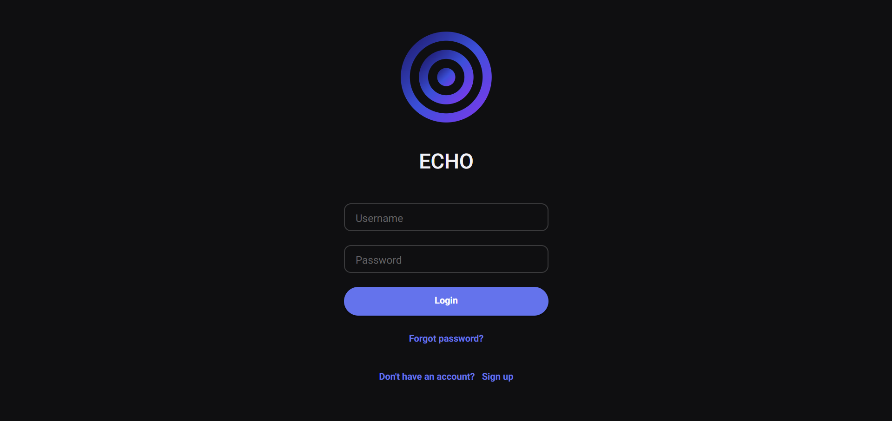
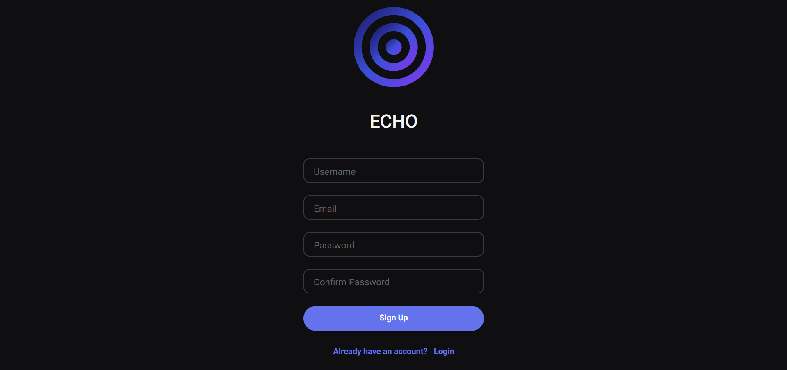
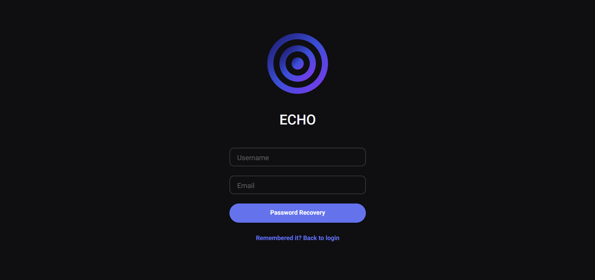
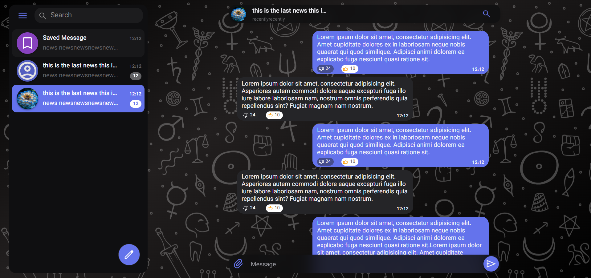
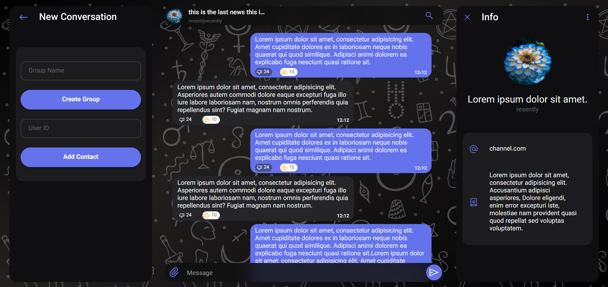
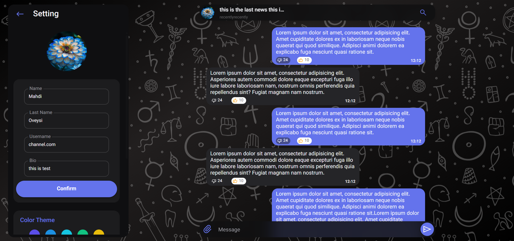
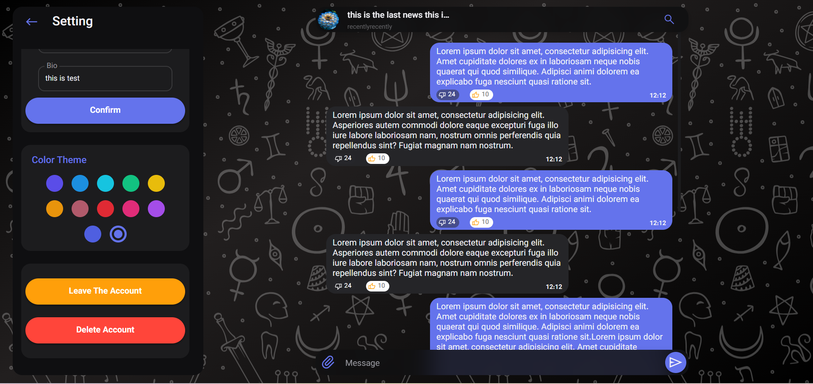

# ECHO

A full-stack Web Chat application built for the Advanced Programming course. It was developed to practice client-server architecture, HTTP communication, file-based storage, and the basic features of a chat application.

## Project Overview

The application has two main parts:

* **Backend**: built with Java and the built-in `HttpServer`
* **Frontend**: built with vanilla HTML/CSS/JS

Database: In this project, user data, conversations, groups, messages, and reports are stored as files in the `backend/data` folder.

## Features

* User registration and login
* Forgot password
* Contact management
* Block and unblock users
* Create, edit, and delete groups
* Add and remove group members
* Send private and group messages
* Edit and delete messages
* Add and remove message reactions
* Save messages
* Report messages
* Edit user profile
* Search and manage conversations

## Pages

This project includes four main pages. The screenshots below show the basic user flow and the main parts of the interface.

### 1) Login Page

The login page is used to enter the application with a username and password.
From this page, users can sign in to their account or go to the sign up page if they do not have an account yet.

### 2) Signup Page

The sign up page is used to create a new account.
Users enter their basic information here so they can register and use the application.

### 3) Forgot Password Page

This page is used for password recovery.
Users can enter the required information and start the process of resetting their password.

### 4) Home Page

The home page is shown after login.
In this page, users can see their conversations, contacts, groups, and messages, and use the main features of the messenger.

* group and private conversations

* create new conversation and info

* setting

## Project Structure

### Backend

The `backend/src/echo` folder includes these parts:

* `controller`: HTTP controllers
* `service`: main business logic
* `repository`: data access layer
* `model`: domain models
* `dto`: API input and output models
* `security`: validation, encryption, and security tools
* `cli`: command-line management tools
* `network`: HTTP and WebSocket communication

### Frontend

The `frontend` folder includes:

* `pages`: main application pages
* `js/controller`: UI controllers
* `js/model`: app state and API communication
* `js/view`: render functions
* `css`: styles
* `assets`: icons, fonts, logo, and images

## Technologies Used

* Java
* JavaScript
* HTML5
* CSS3
* REST API
* WebSocket
* File-based Storage

## Running the Project

### Backend

* Run the backend project with Java.
* Main class: `echo.App`
* The HTTP server runs on port `8080`
* WebSocket runs on port `8081`

### Frontend

* Open `frontend/index.html` using a local server or a suitable development environment.
* The frontend connects to `http://localhost:8080` for backend communication.

## Database

The application keeps its data in these files:

* `users.txt`
* `conversations.txt`
* `groups.txt`
* `messages.txt`
* `reports.txt`
* `contacts-blockedusers.txt`

Media files are also stored in `backend/data/media`.

## Security Notes

This project includes some basic security mechanisms:

* Password validation
* Limiting login attempts
* Temporary account lock after failed attempts
* Message encryption before saving
